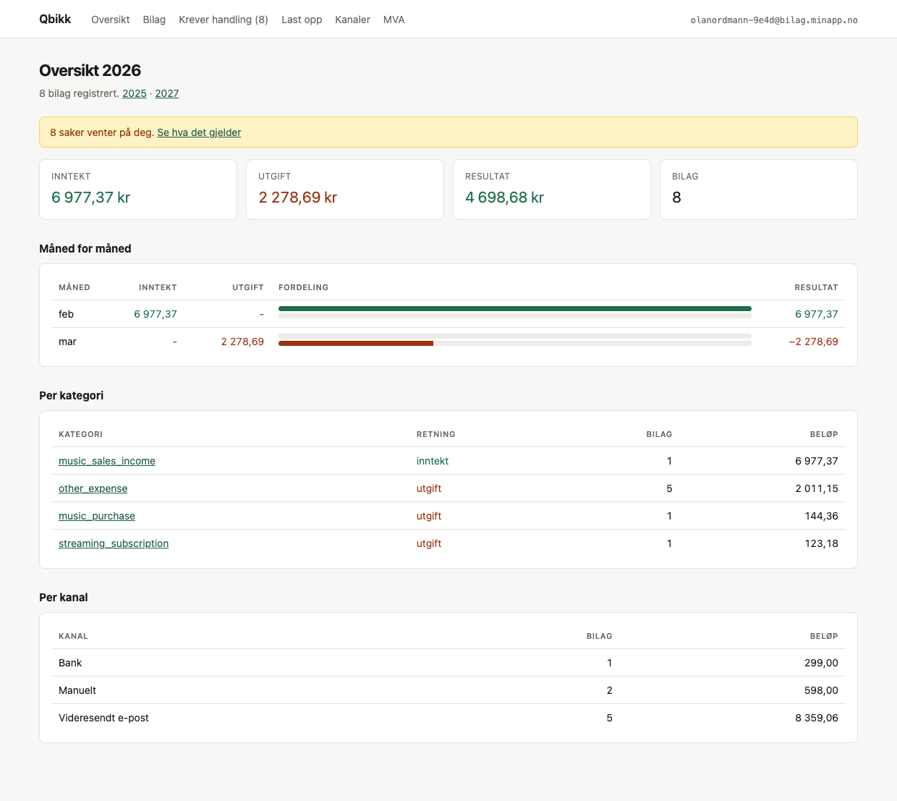
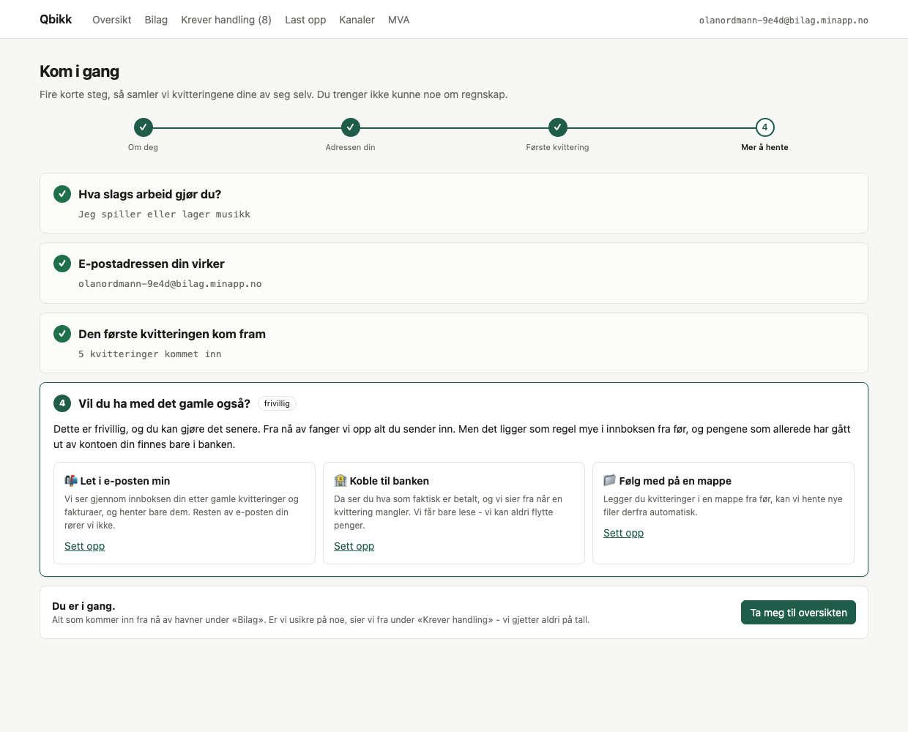
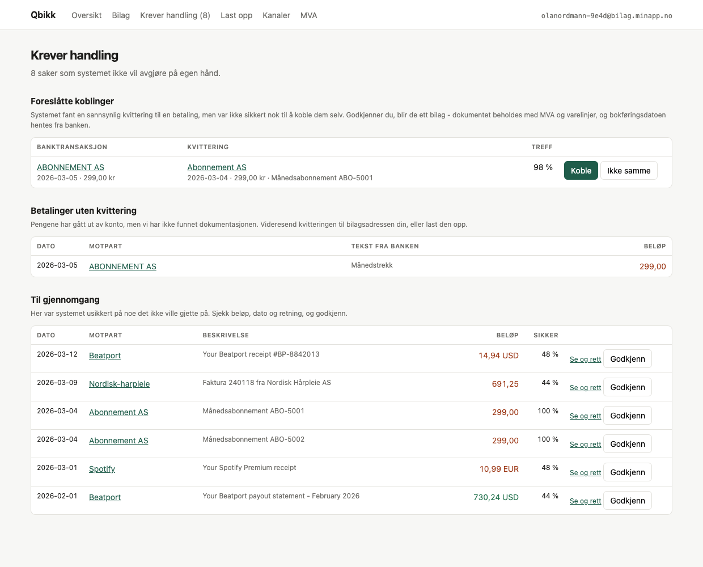
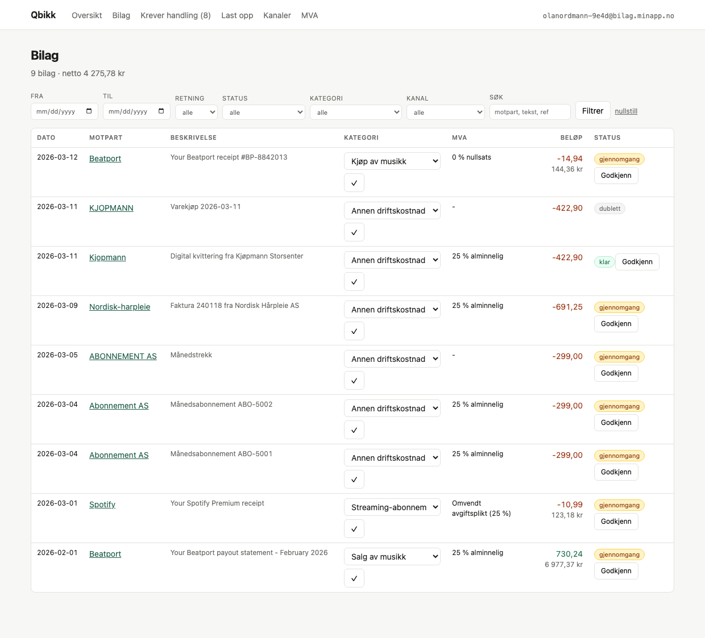
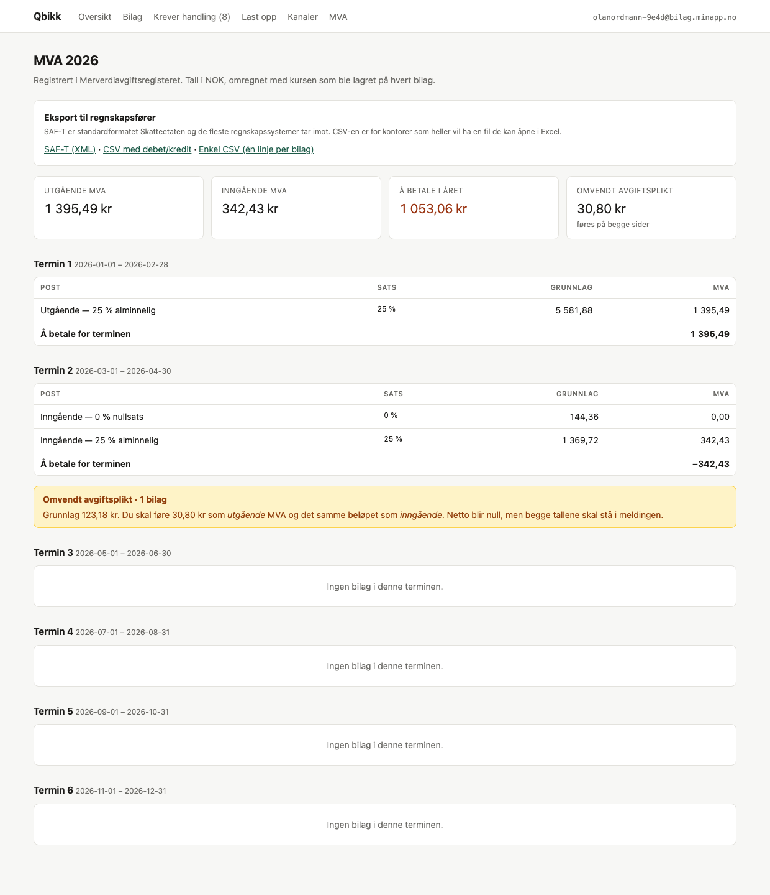
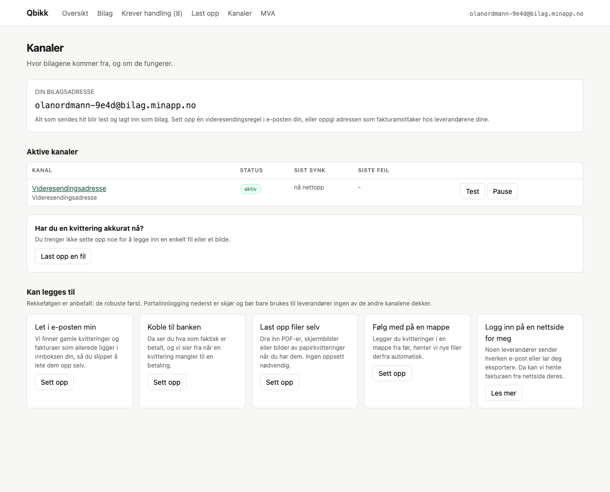

# Qbikk

**Bilagene dine samler seg selv.**

Du videresender en kvittering til din egen e-postadresse. Femten sekunder senere
ligger den i regnskapet — beløp, dato, leverandør, MVA og kontokode, riktig
kategorisert for bransjen din. Er systemet usikkert på noe, sier det fra i stedet
for å gjette.

Bygget for norske selvstendig næringsdrivende: DJ-en, frisøren, kioskeieren. De
som har et regnskap å føre og ingen lyst til å føre det.

<p align="center">
  
</p>

---

## Premisset som styrer alt

**Ikke bygg integrasjoner per tjeneste.**

De fleste leverandører har ikke API. En DJ, en frisør og en dagligvarebutikk har
helt ulike leverandører, og lista tar aldri slutt. Å bygge en kobling per
leverandør er et kappløp man taper.

Men fellesnevneren er alltid den samme: bilag kommer som **dokumenter** —
e-postkvitteringer, PDF-fakturaer, bilder av papirlapper — og pengene vises alltid
i **banken**.

Derfor er systemet dokument- og transaksjonsdrevet. Én LLM-basert ekstraktor leser
alt, uansett bransje og uansett språk. **Bransje er data, ikke en kodevei.** En DJ
og en frisør går gjennom nøyaktig samme ekstraksjon, normalisering, dedup og
matching — det eneste som skiller dem er hvilket kategorisett som slås opp.
[Det finnes en test som passer på nettopp det.](tests/profiles.test.ts)

---

## Kom i gang

Fire steg, ingen fagord. Du velger hva slags arbeid du gjør, får din egen
e-postadresse, og systemet venter mens du sender den første kvitteringen.

<p align="center">
  
</p>

```bash
git clone https://github.com/olavsro/blinkertbror.git && cd blinkertbror

cp .env.example .env
node -e "console.log(require('crypto').randomBytes(32).toString('base64'))"
#  ^ lim inn som ENCRYPTION_KEY i .env
#    sett ANTHROPIC_API_KEY også — se «Uten API-nøkkel» lenger ned

docker compose up -d      # postgres på 5433, mailhog på 1025/8025
pnpm install
pnpm db:push
pnpm seed
pnpm dev                  # web på :3000, worker parallelt
```

I et eget vindu — broen som gjør lokal e-post om til den samme webhooken
produksjonen bruker:

```bash
pnpm mailhog:bridge
```

Og så, for å se det virke med en gang:

```bash
pnpm demo:email alle      # fem ekte kvitteringer inn via SMTP
pnpm demo:bank            # banktrekk som matcher dem
```

Krever Node ≥ 20.11, pnpm og Docker.

---

## Slik virker det

```
   kvittering                                                     regnskap
        │                                                             ▲
        ▼                                                             │
  ┌───────────┐    ┌──────────┐    ┌────────────┐    ┌─────────┐    ┌─┴──────┐
  │  KANALER  │───▶│ RÅLAGRING│───▶│ EKSTRAKSJON│───▶│  BILAG  │───▶│MATCHING│
  │ 6 stykker │    │ uendret  │    │   Claude   │    │ + dedup │    │bank⇄dok│
  └───────────┘    └──────────┘    └────────────┘    └─────────┘    └────────┘
                    append-only     versjonert        3 lag           foreslår,
                    sha256          kan kjøres om     dedup           utfører ikke
```

**Rådokumentet lagres uendret og endres aldri.** All tolkning er avledet. Blir
prompten bedre om et år, kjører du ekstraksjonen om igjen på det samme
dokumentet — uten å miste noe. Den gamle tolkningen blir stående med
`superseded_at`, så et bilag fra 2026 kan fortsatt forklares i 2031: du ser
hvilken modell og hvilken prompt som produserte tallene.

### Kildene

| Kilde | Hva den gjør | Status |
|---|---|---|
| 📧 **Videresending** | Din egen adresse. Alt du sender dit blir lest. | ✅ Kjørt ende-til-ende |
| 📬 **Innbokssøk** | Finner de tre årene som allerede ligger i innboksen. | ⚠️ Aldri kjørt mot ekte IMAP |
| 🏦 **Bank (PSD2)** | Fasit på hva som faktisk er betalt. | ⚠️ Aldri kjørt mot ekte bank |
| 📄 **Opplasting** | Dra inn PDF eller bilde av en papirlapp. | ✅ Virker |
| 📁 **Mappe** | Følger med på en mappe du bruker fra før. | ✅ Lokal mappe virker |
| 🌐 **Portalinnlogging** | Siste utvei for leverandører uten noe annet. | 🚧 Rammeverk, ingen sjåfør |

Alle seks implementerer det samme grensesnittet
([`IngestionChannel`](packages/ingestion/src/types.ts)). Alt bak det punktet —
lagring, tolkning, dedup, matching, dashboard — vet ikke hvor et bilag kom fra.
Å legge til en kilde er å skrive **én fil**.

---

## Fire avgjørelser som former alt

### 1. Retning kommer fra dokumentet, aldri fra navnet

Beatport selger musikk til deg (**utgift**) og betaler ut ditt eget salg
(**inntekt**). Samme leverandør, motsatt fortegn. Et system som gjettet ut fra
leverandørnavnet ville bokført halve inntekten til en DJ som kostnad.

Så leverandørhintene i bransjeprofilene setter **aldri** retning. De har en
kategori per retning, og hvilken som gjelder avgjør dokumentet.
→ [`direction.test.ts`](tests/direction.test.ts)

### 2. Usikre matcher foreslås, de utføres ikke

To abonnementer trukket samme dag på samme beløp. Banken viser ett trekk. Hvilken
kvittering hører til? Det kan ikke avgjøres av tallene — og det er nettopp da en
automatisk kobling ville tatt feil omtrent halvparten av gangene, usynlig, fordi
totalen fortsatt stemmer.

Derfor kobles bare det utvilsomme automatisk. Alt annet havner i «krever
handling» med et forslag og en score. **En match på 98 % blir stående og vente
hvis nummer to var like god.**

<p align="center">
  
</p>

### 3. Dedup i tre lag — og det tredje er med vilje omvendt

1. **Råbytes.** sha256 over dokumentet. Samme e-post videresendt to ganger blir én rad.
2. **Bilagsidentitet.** Samme kvittering fra videresending *og* fra innbokssøk blir **ett** bilag.
3. **Bank og dokument har med vilje ULIKE nøkler** — så de kan eksistere samtidig
   og bli koblet av matcheren. Hadde de fått samme nøkkel, ville den andre
   importen blitt stille avvist, og vi hadde mistet enten bankens fasit på beløp
   eller kvitteringens MVA og varelinjer.

→ [`dedup.test.ts`](tests/dedup.test.ts)

### 4. Ingenting slettes, ingenting overskrives

`corrections` er append-only. Retter du en kategori, skrives gammel og ny verdi
med tidspunkt — og systemet **lærer en regel**, så samme leverandør havner riktig
neste gang. Slås et bankbilag sammen med en kvittering, beholdes begge radene;
den ene merkes bare som dublett med en peker til den andre.

Bokføringsloven krever fem års sporbarhet. Det er ikke en funksjon man skrur på
etterpå.

<p align="center">
  
</p>

---

## MVA, inkludert den alle glemmer

Norske satser (25 / 15 / 12 / 0 / fritatt), terminer, og **omvendt avgiftsplikt i
sin egen seksjon**.

Kjøper du fjernleverbare tjenester fra utlandet — Spotify, Adobe, AWS, Beatport —
skal *du* beregne 25 % utgående MVA og føre det samme beløpet som inngående.
Nettoeffekten er null, så det er fristende å tro at det ikke betyr noe. Men
**begge** tallene skal i MVA-meldingen, og at de ikke blir det er en av de
vanligste feilene i småbedrifter med utenlandske abonnementer.

<p align="center">
  
</p>

Eksport til regnskapsfører: **SAF-T Financial** (XML) og to CSV-varianter. Begge
bygger på samme posteringsfunksjon, så de kan ikke regne ulikt, og eksporten
nekter å levere en fil der debet ikke er lik kredit.

---

## For agenter: MCP

En MCP-server med ti verktøy over stdio — `search_vouchers`, `list_action_items`,
`vat_summary`, `create_voucher`, `attach_document`, `correct_voucher`,
`propose_match`, `confirm_match` og flere.

```bash
pnpm mcp
```

**Ingen av verktøyene skriver til databasen selv.** Alle kaller de samme
pipeline-funksjonene som webhooken og UI-et, og *kan* derfor ikke omgå dedup,
korreksjonshistorikk eller matchereglene. `create_voucher` to ganger med samme
data gir deg det eksisterende bilaget tilbake.

`propose_match` og `confirm_match` er bevisst adskilt: en agent kan foreslå en
kobling, men å slå to bilag sammen krever et eget, eksplisitt kall.

---

## Uten API-nøkkel

Systemet kjører fint uten `ANTHROPIC_API_KEY` — da faller det tilbake på en
regelbasert leser, og **alle bilag havner i gjennomgangskøen**.

Det er riktig oppførsel, ikke en feil. Den regelbaserte leseren kan ikke lese PDF
eller bilder i det hele tatt, og finner ikke selgers land, som er det som utløser
omvendt avgiftsplikt. Den er der for at prosjektet skal kunne kjøres og
demonstreres uten nøkkel, og for at testene skal være deterministiske.

**Ikke «fiks» den ved å gjette bedre.** Et bilag til gjennomgang er alltid bedre
enn et bilag med oppdiktet beløp.

---

## Under panseret

| Lag | Valg | Hvorfor |
|---|---|---|
| Språk | TypeScript, ESM, strict | `noUncheckedIndexedAccess` også |
| Database | PostgreSQL 16 + Drizzle | 15 tabeller, SQL-nær, ingen kodegenerering |
| Jobbkø | pg-boss | Samme database. Ingen ekstra container, jobber i samme transaksjon som dataene |
| LLM | Claude, `messages.parse()` + zod | Leser tekst, PDF **og** bilder i ett kall — ingen egen OCR-pipeline |
| Web | Next.js 15, React 19 | Serverkomponenter, nesten null klient-JavaScript |
| Penger | `bigint` i øre | Aldri float. Aldri `parseFloat` på et beløp |

```
packages/
  db/          15 tabeller, 7 enums          apps/
  core/        domenet + pipeline              web/     dashboard, bilag, MVA, webhooks
  extraction/  Claude + regelbasert fallback   worker/  jobber, synk, matching, cron
  ingestion/   6 kanaler + registry            mcp/     10 verktøy over stdio
  jobs/        pg-boss, typede payloads
  export/      SAF-T + CSV
```

Avhengighetsretningen brytes aldri: `db ← core ← {extraction, ingestion, export} ← jobs ← apps`.
`core` importerer **ikke** `ingestion` — pipeline definerer sin egen dokumenttype,
strukturelt lik kanalenes. En kanal produserer noe som passer; core vet ikke at
kanaler finnes.

---

## Test

```bash
pnpm test        # 112 tester, ingen nett- eller databasekall
pnpm typecheck   # 9 pakker
```

Testene mocker bort valutaomregning, så de aldri ringer Norges Bank. En test som
gjør det, feiler når nettet er nede og gir ulike svar på ulike dager — da tester
den ikke koden vår, den tester internett.

| Test | Passer på |
|---|---|
| `profiles` | DJ og frisør gjennom nøyaktig samme kall |
| `direction` | Beatport begge veier |
| `dedup` | Ett bilag fra to kanaler, to bilag fra bank + kvittering |
| `matching` | Tvetydig match blir foreslått, ikke utført |
| `money` `vat` `fx` | Beløpsformater, satser, terminer, `UNIT_MULT=2` |
| `channels` | Signaturverifisering, registret |
| `export` | Debet = kredit |

---

## Kommandoer

```bash
pnpm dev              # web + worker
pnpm seed             # én bruker, adresse, kategoriregler
pnpm demo:email alle  # fem fixtures inn via SMTP
pnpm demo:bank        # banktrekk som matcher
pnpm smoke <fixture>  # én fixture gjennom pipeline, skriver ut bilaget
pnpm mailhog:bridge   # lokal e-post → produksjonswebhook
pnpm mcp              # MCP-server
pnpm db:studio        # Drizzle Studio
```

---

## Status

Alt fra den opprinnelige planen er bygget: pipeline, seks kanaler, worker, web,
MCP, eksport og tester. Hele veien fra en videresendt e-post til et bilag i UI-et
er verifisert mot en ekte database.

**Det som gjenstår, ærlig:**

- **`ClaudeExtractor` er aldri kalt mot API-et.** Skrevet og typesjekket, men
  ikke kjørt. Dette er den største gjenstående posten — alt nedstrøms er
  begrenset av den.
- **IMAP og bank er aldri kjørt mot ekte servere.** Skrevet mot dokumentasjonen.
- **Portaldrivere finnes ikke.** Kanalen har grensesnitt, samtykkesperre og
  minimering, men ingen som kan klikke seg gjennom en faktisk nettside.
- **Dropbox og Drive** mangler drivere. Lokal mappe virker.
- **SAF-T er ikke validert mot Skatteetatens XSD.** Filen er velformet og går i null.
- **Ingen innlogging.** Én bruker per installasjon. `user_id` er i hele skjemaet
  og i alle spørringer, men det finnes ingen RLS i databasen.
- **Ingen kostnadstak** på ekstraksjon. En backfill over fem år kan bli mange
  tusen LLM-kall.

Detaljene ligger i [CLAUDE.md](CLAUDE.md) — overleveringsdokumentet, som er
skrevet for at en ny utvikler (eller agent) skal kunne fortsette uten å spørre.

<p align="center">
  
</p>
